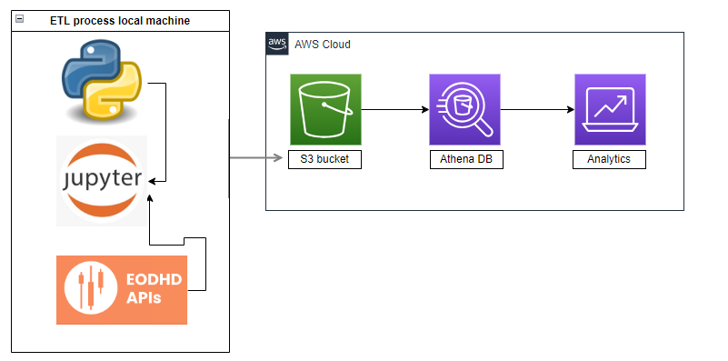

### EOD data extraction ETL process

The process will extract data from [eodhistoricaldata.com](https://eodhistoricaldata.com/) API. This API offers historical and end-of-day financial market data for various asset classes, including stocks, indices, options, futures, currencies, and cryptocurrencies. The data provided may include historical prices, trading volumes, fundamental financial data, splits, dividends, and more.

The diagram above shows the basic architecture on how works the ETL by manipulating data using pandas in Jupyter Notebook, from there the datasets are loaded in S3 using awswrangler.

